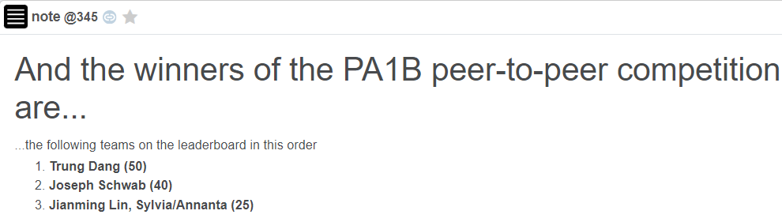

# Peer To Peer File Transfer System In Python

This repository provides the source code to the Peer To Peer file transfer system that I used in [UMass Amherst CS453: Computer Network](https://sites.google.com/view/cs43-s22/overview?authuser=0).

The project requires both discovery of peers and fast and accurate file transfer protocol. The given threshold was 48 seconds for a 800 kB file [redsox.jpg](./PeerToPeer/redsox.jpg). By using multithreading and memory buffer, I was able to reduce this time to 36 seconds. This matches the best run time given by the solution, and was the best one among 150 students of the class. 

***For UMass students**: Winning this P2P minicontest comes with a generous amount of extra credit as well!*

## Overview
### Client Server and Peer To Peer file sharing

Unlike the client server model, where each client will get served by the listening server, the peer to peer file sharing model takes advantage of the cumulative power of the peers.

If a file is of size $F$ bytes is to be distributed to $N$ clients, the server upload rate is $u_s$ and the min client download rate is $d_{min}$ then in Client-Server model, it will take:

$$D_{CS} = max\{NF/u_s,F/d_{min}\} $$

Meanwhile, the P2P model improves this by only making the server tranmit the file once, resulting in a delay of $F/u_s$ rather than $NF/u_s$. Meanwhile, the cumulative time of upload is $$NF/(u_s + \sum u_i) \approxeq NF/Nu_i \approxeq F/min(u_i)$$

Therefore, when $N$ is very large and $d_{min}$ is acceptable, the expected time of file transfer is:
$$D_{P2P} = max\{F/u_s,F/d_{min},NF/(u_s + \sum u_i)\} \ll D_{CS}$$

### Multi-threading
Data chunks are requested via TCP, so loss and corruption is already handled by the packages. For TCP implementation, see my [cs453-project2](https://github.com/dmtrung14-courses/cs453-proj2/).

Because the server is rate-limited, multi-threading will not work on Client-Server model. However, on the Peer-To-Peer model, we can create one thread for each peer, and concurrently request for data.

Because each user may only establish 5 connections to peers (who are actually different randomized ports of the same server), the first idea was to divide the chunks into modulo 5: the first peer to handle chunks number $0, 5, 10,...$ ; the second to handle chunks $1, 6, 9,...$ ; and so on. This solution would give approximately 48 seconds average run time, but it was not good enough for the leaderboard. 

The second idea is to store the latest unhandled file as a variable, and then use a [semaphore / mutex](https://www.geeksforgeeks.org/mutex-vs-semaphore/) to capture and update the variable every time a thread is free. This is better because the channel is noisy, so some threads will just finish first and stay idle, while some other threads struggles to download a few chunks. So having the good channels do more work significantly smoothen the downloading process.

### Peer discovering

One problem of the Peer To Peer file sharing is peers churning from the network once it has received what it needed. (and we won't know when). So it is important to keep the information about which peer remains active, and find a replacement when one of our favorites churn from the network.

## FAQs
Refer [here](https://bitbucket.org/compnetworks/csp2p-downloader/src/2d6bc3fb7309ab4a72a24d5ee8c4bd1399d897cc/Tips.md) for Frequently Asked Questions

## Installation

All the packages used in this project are from Python standard library, so if you have `Python >= 3.8`, you will be fine.

The server might not be running all year long, but the source code can be found [here](https://bitbucket.org/compnetworks/sockets/src/master/). It comes in both Java and Python, and can be run locally.
